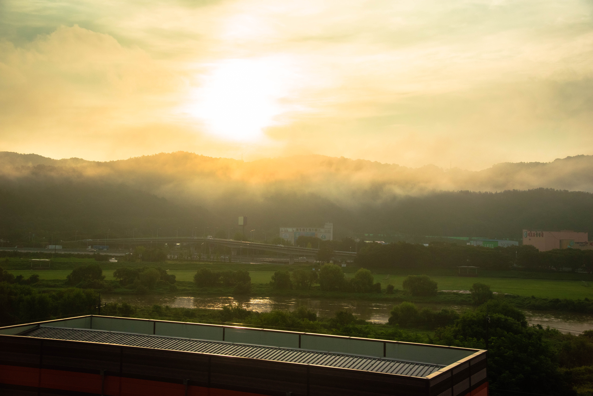
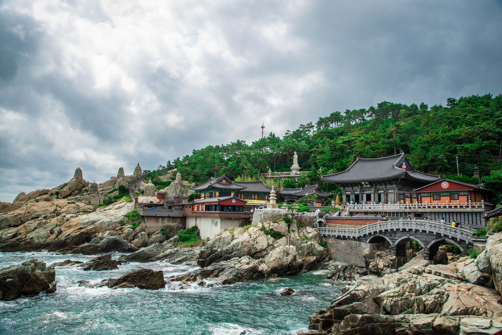
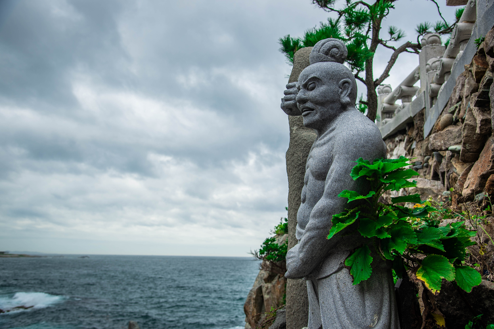
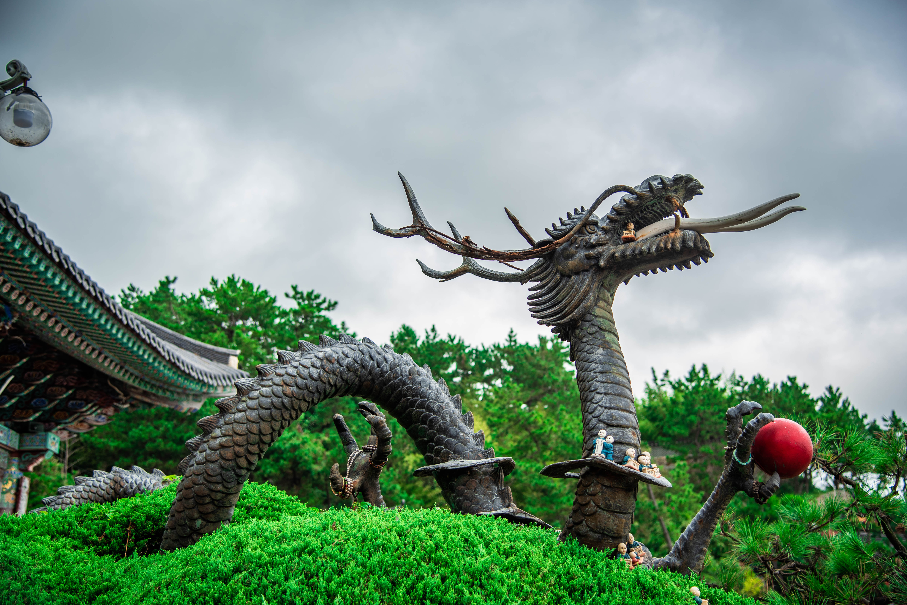
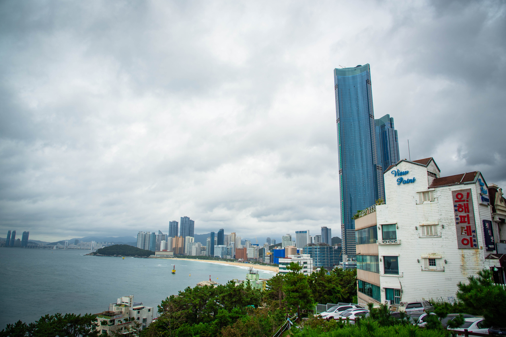
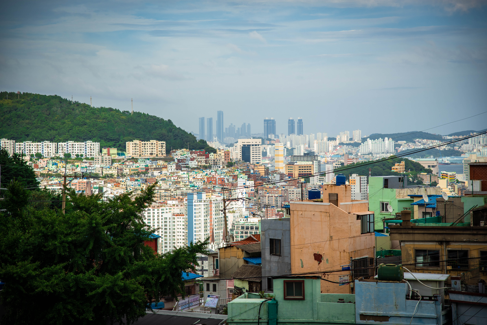
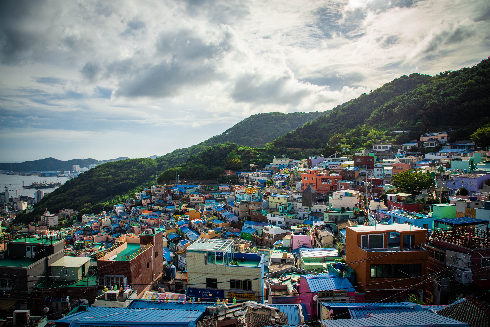
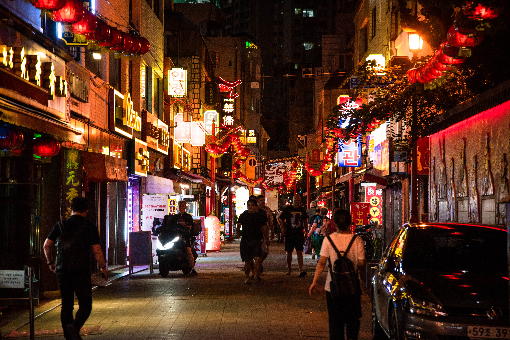
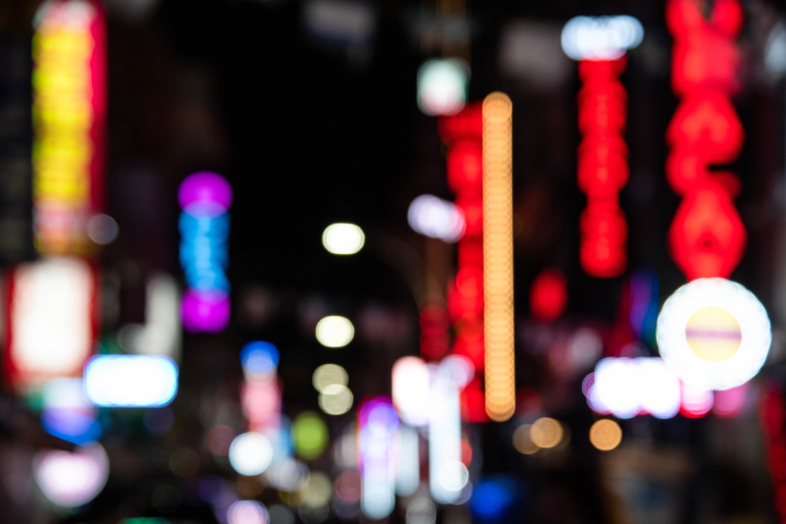

Dagen började redan klockan 04.50 och redan vid 06.00 förväntades våra trötta stjärtar färdas i södergående riktning mot Busan som är Sydkoreas näst största stad. Busan är en hamnstad med en befolkningsmängd på nästan 4 miljoner invånare och kan ses som ett svar till Sydkoreas Göteborg med tanke på att den är landets viktigaste hamnstad med en del industrier som ligger till grund till dess ekonomiska relevans för landet. Staden är också känd för sin kulinariska orientering med inspiration främst från havet och sina många resorts för folk som gärna spenderar dagen i lägre knop. 
En nästan tre timmar lång tågfärd påbörjades 06.00 och bjöd på fina landskapsmotiv av den Sydkoreanska landsbygden och andra mindre städer längs vägen och ett skiftande väder.

På eftermiddagen tog vi en buss från centrala Busan och gick sen resten upp för en massa backar för att komma till Gamcheon Culture Village vilket de kallar för "Machu Picchu of Busan". Väldigt fint och väldigt svettigt som sagt. Skapar skarpa kontraster till stan.

Personligen skulle jag även kalla byn för "Favelas of Busan" då de påminner mycket om de områden som finns i Rio De Janeiro med sin trappliknande arkitektur. Färger snålades inte med. Nästan som att titta ner i sen skål med Fruit Loops.

Vi avslutade dagen på Foreigner Street.

