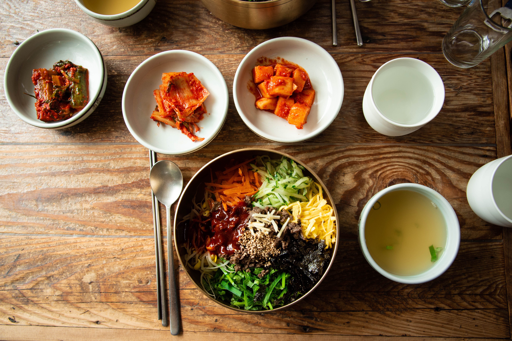

Jag och Sebbe hade ett problem. Vi hade köpt ett Korail pass, och vi behövde använda det.
Så varför inte åka till Jeonju. Jeonju ligger en sisådär 20 mil från Seoul. och efter två timmar
och en extra timme när sebbe glömde hoppa av tåget var vi äntligen där.

`youtube: https://youtu.be/4pn-6OC0Luc`

Vi har landat i Jeonju Cultural village. 800 hus till största delen ockuperade av diverse turistfällor.

Nåväl. Det viktigaste med Jeonju är ändå Bibimbapen. Det är härifrån den kommer. I alla fall en av de olika sorterna av Bibimbap som finns. Vi lyckades såklart beställa fel sort. Men den är ändå fantastiskt god.

När du får din bibimbap är den egentligen inte klar. Du måste röra om den. Det är då magin händer.
Notera även Kimchin. Fullständigt magiskt.

