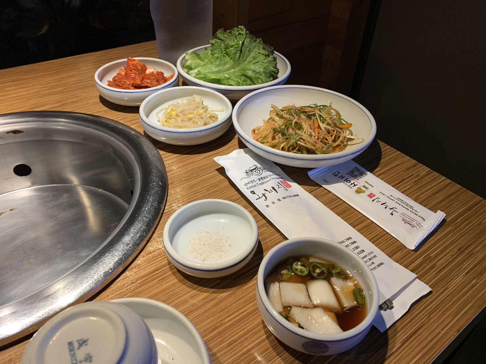
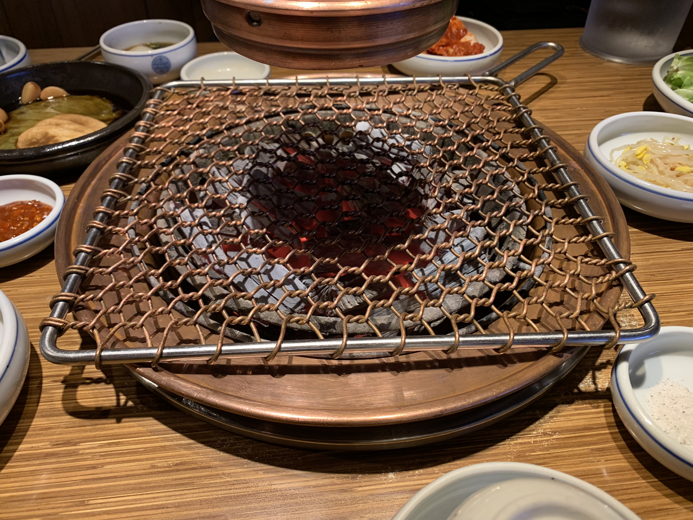

Nu börjar resan lida mot sitt slut, vi har låtsas som att det funnits mycket att göra, men egentligen
vet vi ju alla att vi är här för att äta. Här kommer en liten utläggning om hur det är att äta såhär nära kommunismens högborg.

Dessa underbara side dishes! Oftast är det olika sorters kimchi, mest känd som den fermenterade kål som vi kan få om vi har tur i Sverige, men den görs även på andra rotfrukter och grönsaker.

Utöver det har vi även diverse bönor och groddar. Tar de slut kommer de oftast ut med mer. Detta i kontrast till Sverige, där jag kollade en koreansk restaurang nära hem som tog hela 56 kronor för en liten tallrik kimchi. Fräscht.

Så har vi tillagningen. På väldigt många ställen lagas maten där du sitter, om du har tur över en kolgrill mitt i bordet.

Vanligen grillar personalen åt dig vid bordet, men ibland får du själv äran att göra arbetet själv.

Här har vi en video om hur det kan se ut när man är mitt i det hela.

`youtube: https://youtu.be/0Kwq4xcOUak`
