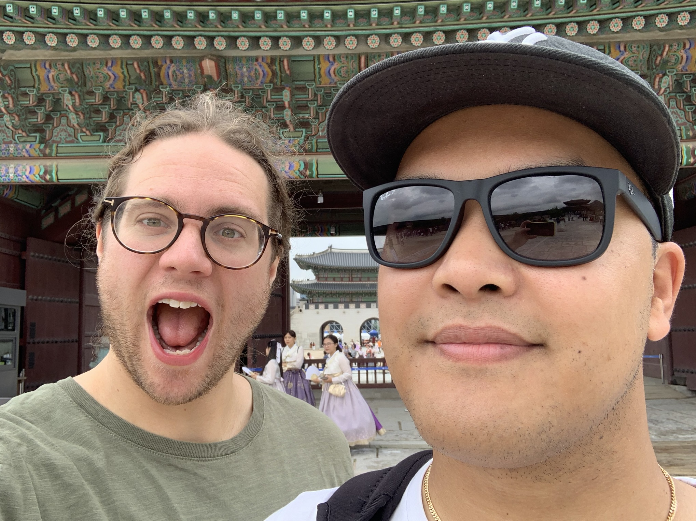
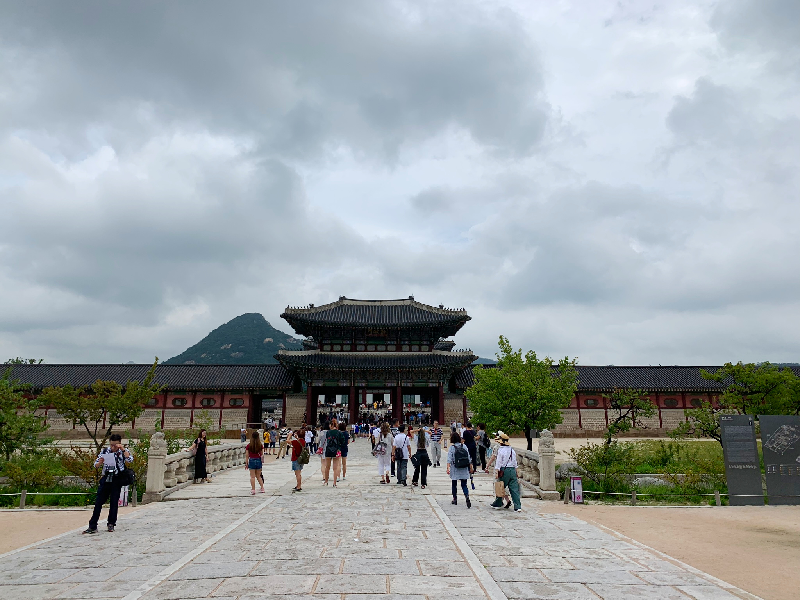
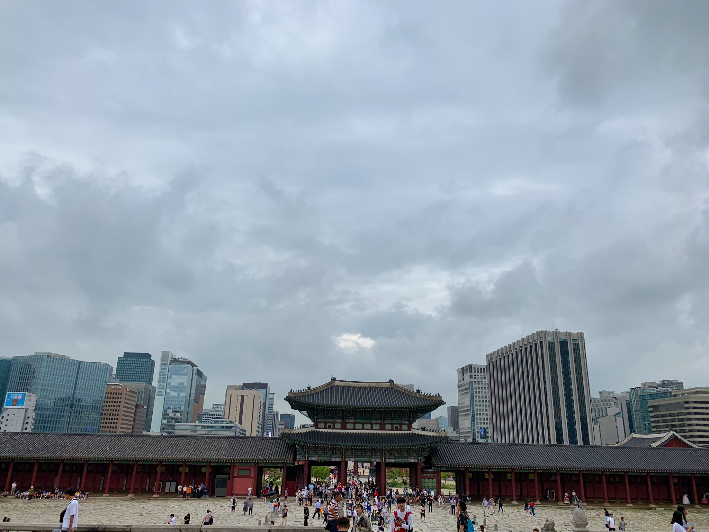
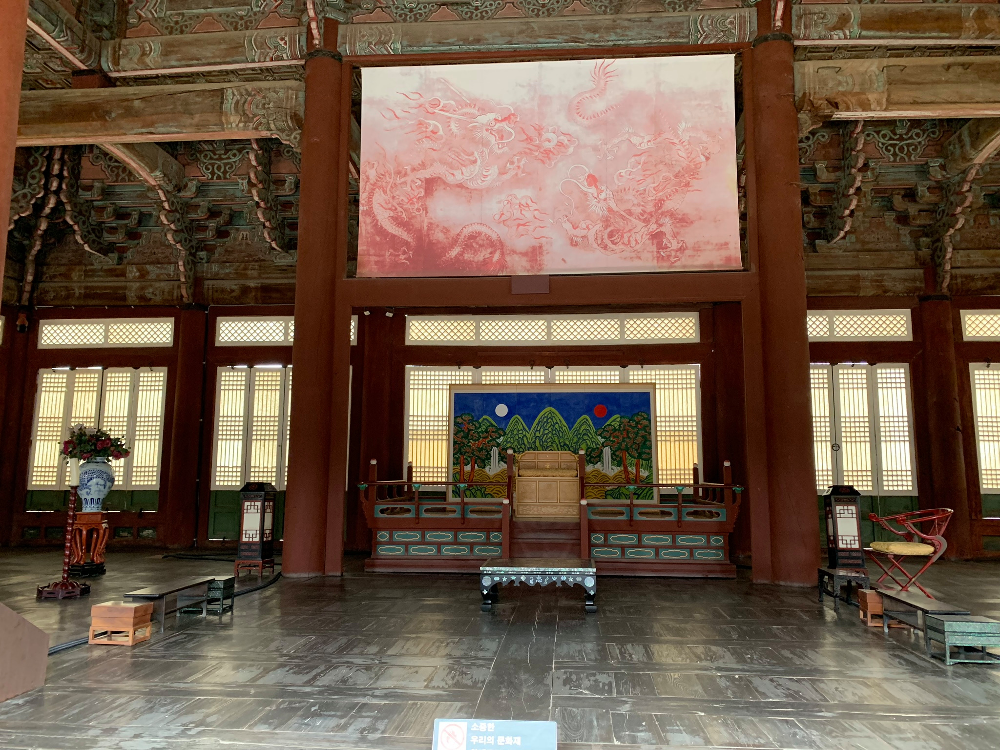
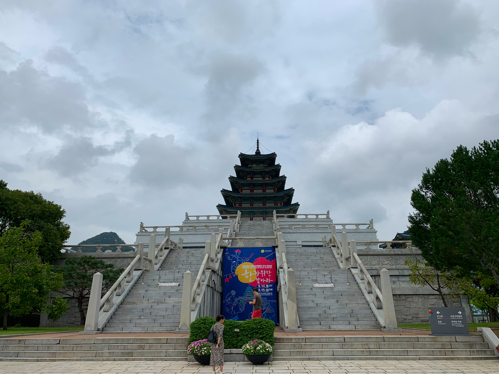
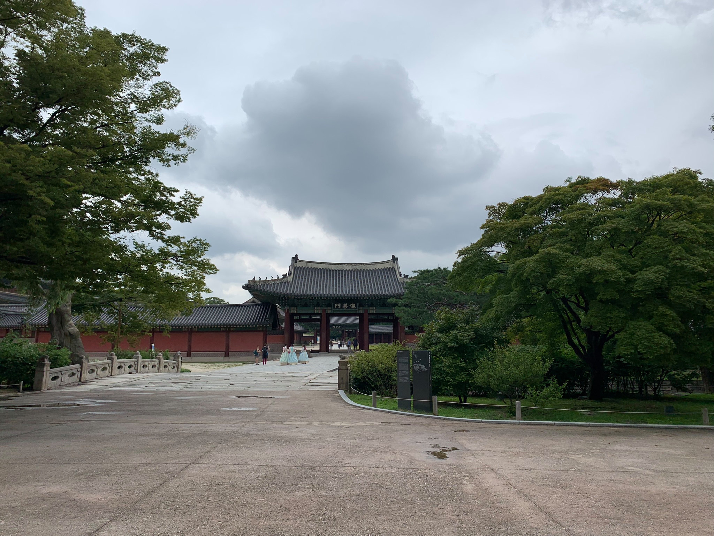
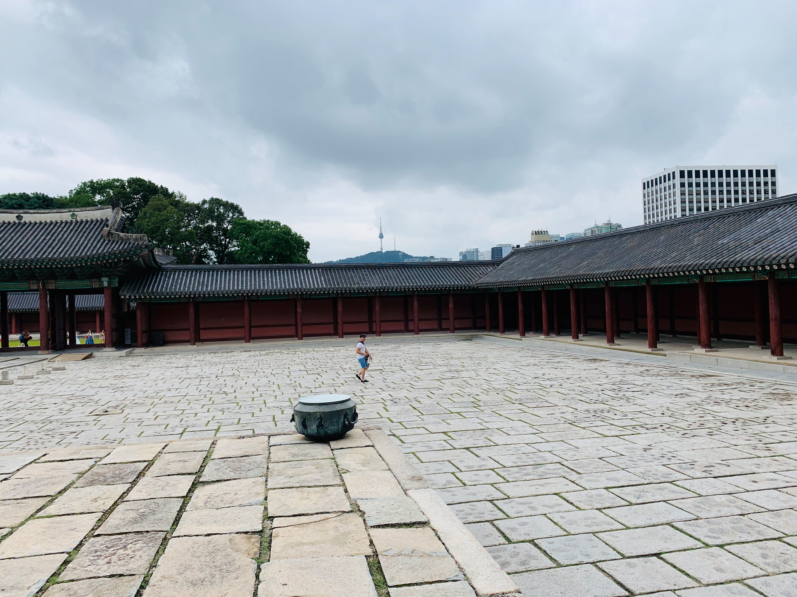

När jag och Sebbe reser är det inte en resa utan diverse besök till
olika palats, tempel och andra gamla byggnader.

Vi satte igång direkt med Gyeongbokgung, Det kungliga palatset
under Joseon-dynastin.

Hela palatset har fått byggas upp igen efter diverse krig och elaka japanska kolonister.
Men på de hela taget har de gjort ett ganska bra jobb.

Palatset är byggt i flera lager, med det viktiga längst in. Utanför finns det diverse olika palats.

Det är heller inte semester om man inte får titta på minst en pagoda.

Palatskalset var inte slut där. Vidare till Changdeokgung Palace, öster om det första palatset.

Det fanns nån trädgård också men dit var vi inte välkomna utan guide. Sånt jobbar vi inte med. Nog om detta.
