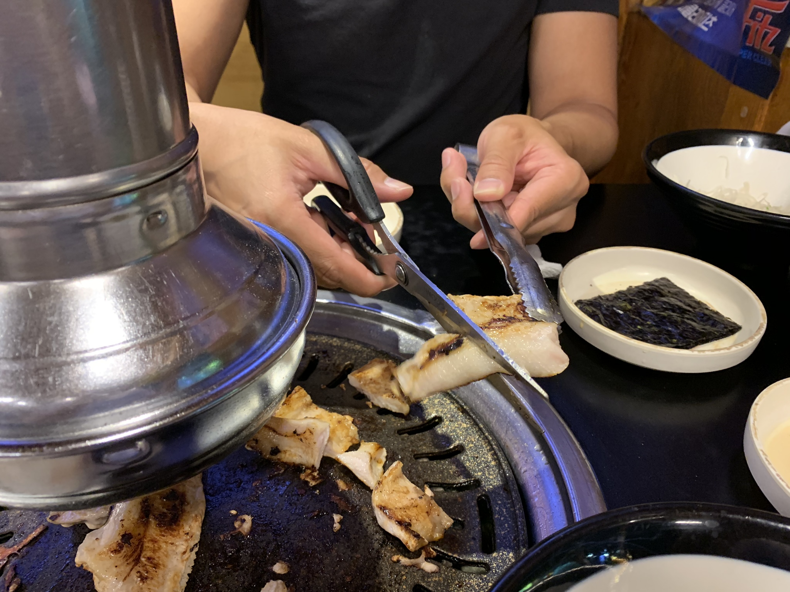

Att ta saxen ur kökslådan och lägga den på bordet när man ska äta skulle troligtvis höja ögonbrynen hos de andra personerna runt bordet.
Vad vi fått erfarat hittils under våra middagar (främst Korean BBQ) är att saxen har en central roll i det koreanska köket. Istället för att dela maten med knivar klipper man upp maten i små bitar för att sedan plockas upp med ätpinnar och förtäras.

Det skulle antingen i första anblick anses osmakligt att tänka tanken att klippa upp hela sin måltid med en sax istället för att använda kniv och gaffel. Detta gäller både kött och grönsaker och allt annat som går att klippa.

Så varför är det så? Jo sjävklart beror det på den uppsättning bestick som koreanerna använder sig av vanligtvis, vilket inte är som här hemma som kniv och gaffel utan en sked och ätpinnar. Sen är det koreanska upplägget mer så att samtliga ingredienser plus eventuell grill är placerade i mitten och du tar själv de ingredienser du känner för med dina ätpinnar. Tänk detta ur ett logistiskt perspektiv. Om du är van vid kniv och gaffel, så tänker du "Jag behöver en kniv och gaffel för att skära en bit kött." Men vänta, även om du bad om en kniv och gaffel, vart skär du den på? På ett litet fat som tar extra plats på det redan packade bordet? Det är inte ovanligt att varje person har minst fem skålar med bara sides. 
Detta kommer till punkten där någon använder ätpinnar/tång för att ta en bit från grillen etc. och använder saxen för att klippa upp köttet till mindre bitar. Givetvis är det lämpligt att använda två olika saxar, en för kött och en för grönsaker om det till exempel är vegetarianer med i sällskapet. Det menas dock inte att koreaner aldrig äter med kniv och gaffel. 
