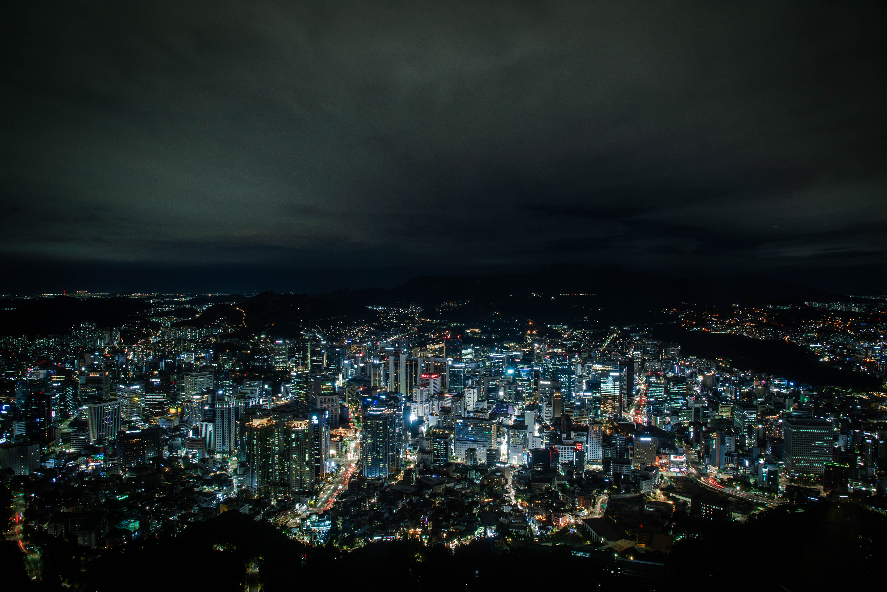

Sydkorea har under vår vistelse inte bjudit på det bästa vädret. Det har varit rikligt med regn och blåsigt på sina håll. Troligtvis beror 
det delvis på tyfonen Lingling som härjade över stora delar av Sydkorea och säsongsskifte.
Under denna dag så tittade solen fram och vi passade på att göra den dagsutflykt till Sewon som är en liten grannstad till Seoul. Besöket blev inte jätteinspirerande, men vädret var förhållandevis bra, om inget annat väldigt fuktigt och svettigt.

Då kvällen blev betydligt klarare och med återstående "måsten" som en ska göra som turist hoppade vi på en buss mot Seoul Tower som jag antar är stadens bästa utsiktsplats.'
Tornet är beläget på ett berg vilket bjöd på en härlig 1,5km lång uppförsbacke. Detta på grund av att vi inte tog en specifik buss.

Väl uppe på toppen och efter allt turistfjomp tog vi hissen upp till tornets topp bjöds det på fina vyer. Faktiskt finare vyer än vi båda tänkte oss, ingen av oss gick inte med några större förväntningar heller.

Det är något fascinerande med att kunna se så mycket av en stad på en och samma gång. Jag vet inte riktigt vad det beror på, men det kanske är något 
undermedvetet hos en om att vi sällan har möjlighet att uppleva sådana vyer annars.

Anyway, det var en bra kväll med en hel del fotande från min sida.
