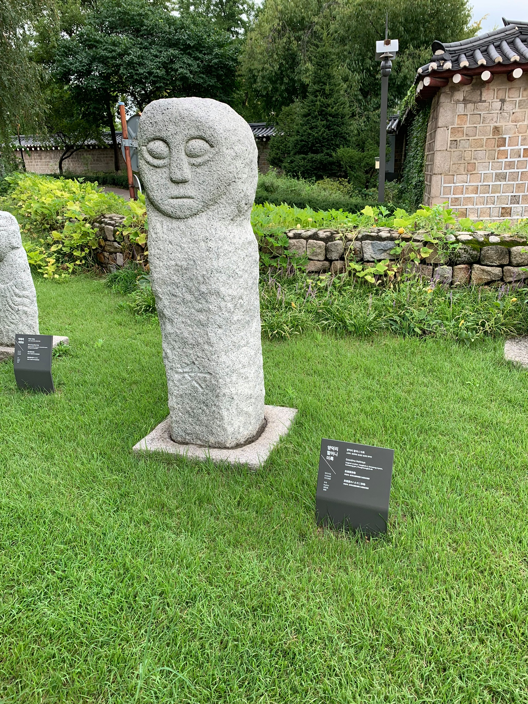

Här i Korea gillar de stenar, och att forma dem till skoj saker.

Här följer en serie stenar som vi tittat på än så länge.

Till att börja med har vi det här gänget som hänger med lite här och var. De är de 12 glada zodiakdjuren. Här i korea har de fått liv i formen nedan.

Zodiakdjuren får inte vara ensamma i äran att bli förstenade.
Även framstående tjänstemän fick äran att få en egen sten.

Sen fanns det även generellt bra statyer att ha av olika klasser.
Här är några av mina favoriter, jag har namngett dem själv.

Även i buddhisttempel finns det en och annan sten. Här är en favorit:

Stenar helt enkelt. Vem gillar inte massa stenar?

