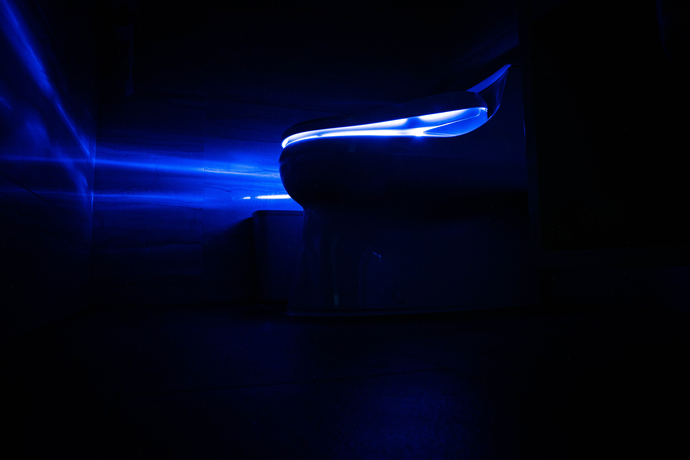
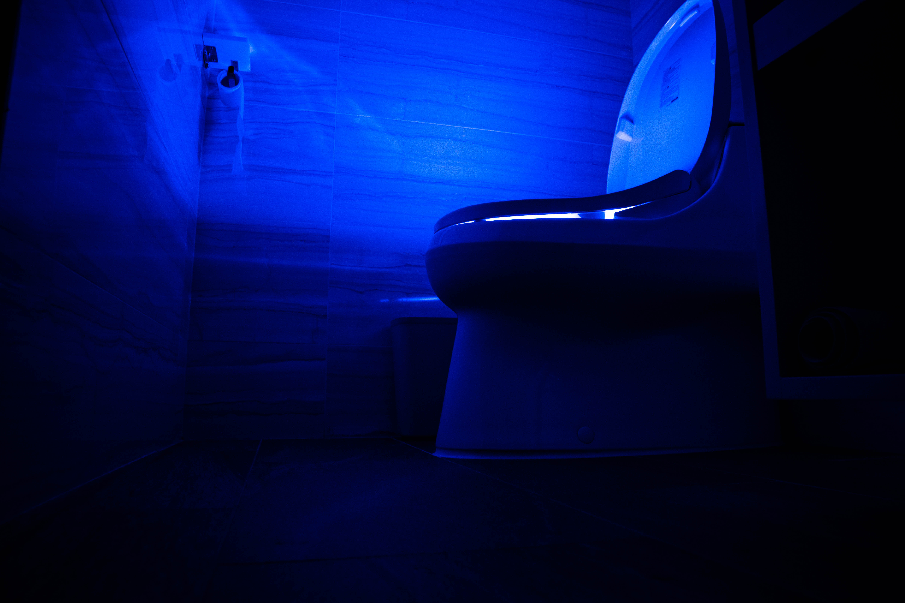

Jag tänkte i detta inlägg trappa ner mitt språk till barnåldern för nu ska vi prata toaletter, kiss och bajs. Som västlänning finns det egentligen inte så mycket spännande att prata om toaletter mer än att gemene man sätter sig ner och uträttar sina behov. Förr så var vissa badrum vad jag observerat inredda med små Dassböcker för de som planerade att spendera en längre tid på toaletten. Idag gissar jag på att vi i snitt spenderar ännu längre tid på toaletten då var och en måste skrolla igenom sina flöden, skriva meddelanden, snapchatta, jag vet inte och vill inte heller veta.

Hursomhelst, för den som någon gång varit i till exempel Japan så har nog inte denne gått miste om att toaletterna där är i en klass för sig. Kan tillägga att Sydkorea delvis tagit efter denna trend då bland annat vårt hotellrum utrustats med en utav de mest sinnessjuka varianter våra bara arslen kommer komma i kontakt med. Den har för fan belysning i hela innandömet som i säkerligen skulle lysa upp ens groteska historik innan den spolas ner i Seouls system.

Utöver belysning finns det funktioner som:
* Uppvärmd toasits 
* Bidéfunktion för både för och akt och kan anpassas för kvinnor och män
* Självrengöring
* Lufttork
* Eliminering av dålig lukt
Och sist men inte minst ljuduppspelning av t.ex. kvittrande fåglar vars syfte är att överösta dina oljud du för när du klämmer ut en "spräck-en-ven-i-pannan-skit" eller annat som relaterar till dina behov.

High-tech toalettkulturen härstammar som sagt från Japan där renlighet är A och O och där tillgången på papper är begränsad. Det är här dessa typer av toaletter kommer in och hjälper till att spara på miljön genom förminskad vatten- och pappersförbrukning. Visst de använder delvis el vilket ger avtryck på annat håll, men för vad de kompenserar så gör de mer nytta för miljön.

Du som användare får en hejdundrans spännande upplevelse, särskilt om du testar samtliga knappar på kontrollpanelen...
