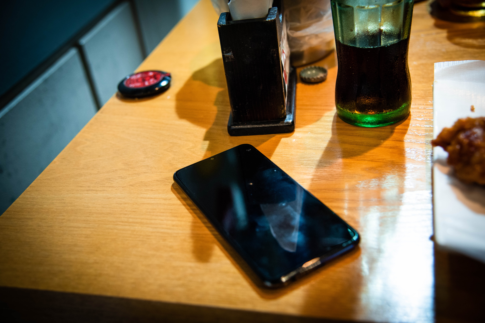

"Håll i dina ägodelar och lämna dem aldrig utan uppsikt!" Det är något som en som svensk mycket tidigt fostrats till. Annars blir oftast konsekvensen att en går minus en plånbok/mobil eller annan sak av värde. Även om en som resande svensk ofta tänker mer på att hålla extra hårt i sina värdesaker när de är utomlands beror mer på att det sker mer stölder i andra länder än i Sverige, men visst, även här hemma får man se upp.
Denna form av inskolning tycks inte finnas hos både det Koreanska folket eller det Japanska av vad vi har fått erfara. Idag till exempel vittnade vi om ett koreanskt par på en restaurang som hade lämnat både mobiler och handväska med troligtvis plånbok vid sitt bord, mitt på öppen gata för att vara borta i minst fem minuter. Ett guldläge för tjuven, men nej, ingen förbipasserande varken observerade eller brydde sig om sakerna medans vi båda satt smått nervösa över någon skulle snabbt knycka allt.
Ärlighet är väl det som finns tillräckligt av för att personer har såpass tillit att deras saker är kvar precis där de lämnade dem och inte i någon okänd persons fickor.

Dagen började redan klockan 04.50 och redan vid 06.00 förväntades våra trötta stjärtar färdas i södergående riktning mot Busan som är Sydkoreas näst största stad. Busan är en hamnstad med en befolkningsmängd på nästan 4 miljoner invånare och kan ses som ett svar till Sydkoreas Göteborg med tanke på att den är landets viktigaste hamnstad med en del industrier som ligger till grund till dess ekonomiska relevans för landet. Staden är också känd för sin kulinariska orientering med inspiration främst från havet och sina många resorts för folk som gärna spenderar dagen i lägre knop. 
En nästan tre timmar lång tågfärd påbörjades 06.00 och bjöd på fina landskapsmotiv av den Sydkoreanska landsbygden och andra mindre städer längs vägen och ett skiftande väder.

